# Araliya Bot — Complete Documentation (v0.2.0-alpha)

**All-in-one reference guide for Araliya Bot architecture, development, and operations.**

**Generated:** March 28, 2026  
**Version:** v0.2.0-alpha

---

## Table of Contents

1. [Introduction & Overview](#introduction--overview)
2. [Getting Started](#getting-started)
3. [Quick Start (TL;DR)](#quick-start-tldr)
4. [Architecture Foundation](#architecture-foundation)
5. [Core Concepts](#core-concepts)
6. [Configuration Guide](#configuration-guide)
7. [Subsystems Reference](#subsystems-reference)
8. [Standards & Protocols](#standards--protocols)
9. [Development Guide](#development-guide)
10. [Testing & Quality](#testing--quality)
11. [Deployment & Operations](#deployment--operations)

---

# Introduction & Overview

## What is Araliya Bot?

**Araliya Bot** is a fast, modular, and fully autonomous AI assistant infrastructure built in **Rust**. It operates as a single-process supervisor with pluggable subsystems, designed to act as a cohesive agentic AI.

### Key Highlights

- **Modular Architecture:** The bot acts as the main entry point (supervisor), owning the event bus and managing global events.
- **Pluggable Subsystems:** Subsystems are separate modules that can be toggled on/off at startup. They can dynamically load, unload, and manage multiple agents at runtime.
- **Event-Driven Communication:** Subsystems and agents communicate seamlessly with each other and the supervisor via a central event bus.
- **Secure Identity:** Automatically generates a persistent cryptographic identity (ed25519 keypair) on the first run, ensuring secure and verifiable operations.
- **Lean & Fast:** Built in Rust for minimal overhead, fast cold starts, and memory safety.

### Performance Profile

| Metric | Value |
|--------|-------|
| Memory Footprint | ~6.1 MB |
| Startup Time | < 1s |
| Binary Size | ~3.5 MB |
| Identity | ed25519 keypair persisted, Markdown identity |
| Channels | PTY (default), HTTP/Axum, Telegram |


---

# Getting Started

## Quickstart (Prebuilt Binary)

Download, configure, and run in three commands on Linux (x86_64 / aarch64):

```bash
# 1. Download the binary and seed config directories
curl -fsSL https://raw.githubusercontent.com/xcorat/araliya-bot/main/install.sh | bash

# 2. Interactive setup wizard
araliya-bot setup

# 3. Validate the generated config
araliya-bot doctor

# 4. Start the bot
araliya-bot
```

### Install Script Details

`install.sh` auto-detects arch, resolves the latest GitHub release, downloads the appropriate tier tarball (`minimal` / `default` / `full`), installs the binary to `~/.local/bin/`, and seeds `~/.config/araliya/` with starter config files.

**Override defaults with env vars before piping:**

```bash
ARALIYA_TIER=full ARALIYA_VERSION=v0.2.0-alpha \
  curl -fsSL .../install.sh | bash
```

### Config locations

- **Config:** `~/.config/araliya/config.toml` (TOML, commented)
- **Secrets:** `~/.config/araliya/.env` (mode 0600, API keys/tokens)
- **Runtime data:** `~/.araliya/` (identity keypair, sessions, memory)

### Setup wizard (`araliya-bot setup`)

The wizard walks through four steps:

1. **Bot identity** — bot name and runtime data directory
2. **LLM provider** — OpenAI / OpenRouter / Anthropic / Local Ollama / custom / dummy + API key + model
3. **Agent profile** — basic chat / session chat / agentic chat / docs / newsroom / custom
4. **Channels** — HTTP bind address; Telegram (token validated live via `getMe`)

**Note:** Re-running `setup` does not overwrite existing secrets in `.env`.

### Config doctor (`araliya-bot doctor`)

Checks config file presence, TOML validity, required sections, and credential env vars. Exits non-zero on failure — useful as a pre-flight check in scripts or CI:

```bash
araliya-bot doctor && araliya-bot
```

---

## Build from Source

### Requirements

- Rust toolchain 1.80+ (`rustup` recommended)
- Linux or macOS
- Internet access for initial `cargo build` (downloads dependencies)

### Build

```bash
cd araliya-bot
cargo build
```

### Modular Features

Araliya Bot uses Cargo features to enable or disable subsystems, plugins, and channels at compile-time. This allows for lean builds on resource-constrained hardware.

| Feature Group | Features | Description |
|---------------|----------|-------------|
| **Subsystems**| `subsystem-agents`, `subsystem-llm`, `subsystem-comms`, `subsystem-memory` | Main architectural blocks. |
| **Agents**    | `plugin-echo`, `plugin-basic-chat`, `plugin-chat`, `plugin-gmail-agent` | Capabilities for the `agents` subsystem. |
| **Channels**  | `channel-pty`, `channel-http`, `channel-telegram` | I/O channels for the `comms` subsystem. |
| **Tools**     | `subsystem-tools`, `plugin-gmail-tool` | Tool execution and implementations. |
| **UI**        | `subsystem-ui`, `ui-svui`, `ui-gpui` | Web UI backend and optional GPUI desktop client. |
| **Binaries**  | `cli`, `gmail-app` | Additional binaries (`araliya-ctl`, `gmail_read_one`). |

### Build Variants

**Default build (Daemon only, all subsystems enabled):**
```bash
cargo build
```

**Build all binaries (Daemon, CLI, Gmail App):**
```bash
cargo build --all-features
```

**Minimal build (No subsystems enabled):**
```bash
cargo build --no-default-features
```

**Custom build (LLM and Agents only):**
```bash
cargo build --no-default-features --features subsystem-llm,subsystem-agents,plugin-basic-chat
```

**Release build:**
```bash
cargo build --release --locked
```

### Building the Web UI

The Svelte UI lives in `frontend/svui/` and builds to `frontend/build/`:

```bash
cd frontend/svui
pnpm install
pnpm build
```

The bot serves the built UI at `http://127.0.0.1:8080/ui/` when `comms.http.enabled = true` and `ui.svui.enabled = true`.

For development with hot reload:

```bash
cd frontend/svui
pnpm dev   # starts on http://localhost:5173/ui/
```

### Building the GPUI Desktop Client

The optional native desktop client is provided as a separate binary and is gated behind the `ui-gpui` feature.

```bash
cargo check --bin araliya-gpui --features ui-gpui
cargo run --bin araliya-gpui --features ui-gpui
```

---

## Running the Bot

### Daemon mode (default)

```bash
cargo run
# or
./target/debug/araliya-bot
```

No stdin is read, no stdout is written. All tracing output goes to stderr. The Unix domain socket at `{work_dir}/araliya.sock` is always active for management.

### Interactive mode

```bash
./target/debug/araliya-bot -i
```

Activates the stdio management adapter and PTY channel:

```
# /status
# /health
# /chat <message>
# /exit
```

### Management CLI (`araliya-ctl`)

While the daemon is running, use `araliya-ctl` from any terminal:

```bash
./target/debug/araliya-ctl status
./target/debug/araliya-ctl health
./target/debug/araliya-ctl subsystems
./target/debug/araliya-ctl shutdown
```

### First Run

On first run the bot generates a persistent ed25519 keypair and saves it to `~/.araliya/bot-pkey{id}/`. Expected output:

```
INFO araliya_bot: identity ready — starting subsystems bot_id=51aee87e
```

### Subsequent Runs

The existing keypair is loaded. The same `bot_id` is printed every time.

### Verify Installation

```bash
# Check identity files were created
ls ~/.araliya/
# → bot-pkey5d16993c/

ls ~/.araliya/bot-pkey5d16993c/
# → id_ed25519   id_ed25519.pub

# Verify secret key permissions (should be 600)
stat -c "%a %n" ~/.araliya/bot-pkey5d16993c/id_ed25519
```

### Environment Variables

| Flag / Variable | Effect |
|-----------------|--------|
| `-i` / `--interactive` | Enable interactive mode (management adapter + PTY). Default: daemon mode. |
| `ARALIYA_WORK_DIR` | Override working directory (default: `~/.araliya`) |
| `ARALIYA_LOG_LEVEL` | Override log level (default: `info`) |
| `RUST_LOG` | Standard tracing env filter (overrides `log_level`) |
| `-v` | CLI override → `warn` |
| `-vv` | CLI override → `info` |
| `-vvv` | CLI override → `debug` |
| `-vvvv` | CLI override → `trace` |

### Logging & Debugging

Log verbosity can be set at runtime with `-v` flags:

```bash
cargo run -- -v      # warn  (quiet — errors and warnings only)
cargo run -- -vv     # info  (normal operational output)
cargo run -- -vvv    # debug (routing, handler registration, diagnostics)
cargo run -- -vvvv   # trace (full payload dumps, very verbose)
```

Example:

```bash
ARALIYA_WORK_DIR=/tmp/test-bot RUST_LOG=debug cargo run
cargo run -- -vvv
```

### Local Testing Without an API Key

The `dummy` LLM provider echoes input back as `[echo] {input}`. Combined with the `minimal` feature set and `basic_chat` agent it gives a full bus round-trip with zero external dependencies:

```bash
cargo build -p araliya-bot --no-default-features --features minimal
./target/debug/araliya-bot -i --config config/dummy.toml
```

---

# Quick Start (TL;DR)

```bash
# Clone the repository
git clone <repo>
cd araliya-bot

# Build the release binary
cargo build --release

# Run the supervisor
cargo run --release
```

**Requirements:** Rust toolchain (1.80+), Linux/macOS

On the first run, a persistent bot identity is generated at `~/.araliya/bot-pkey{id}/`.

---

# Architecture Foundation

## Design Principles

- **Single-process supervisor model** — all subsystems run as Tokio tasks within one process; upgradeable to OS-level processes later without changing message types.
- **Star topology** — supervisor is the hub; subsystems communicate only via the supervisor. Per-hop overhead is negligible (~100–500 ns). Provides centralized logging, cancellation, and permission gating without actor mailbox complexity.
- **Capability-passing** — subsystems receive only the handles they need at init; no global service locator.
- **Non-blocking supervisor loop** — the supervisor is a pure router; it forwards `reply_tx` ownership to handlers and returns immediately.
- **Split planes** — subsystem traffic uses the supervisor bus; supervisor management uses an internal control plane.
- **Compile-time Modularity** — Subsystems and agents can be disabled via Cargo features to optimize binary size and memory footprint.

## Crate Workspace

The codebase is a multi-crate Cargo workspace. Each crate is an independently compilable library; `araliya-bot` is the thin binary that wires them.

```
araliya-core          Tier 0 — config, error, identity, bus protocol, Component/BusHandler traits
araliya-supervisor    Tier 1 — dispatch loop, control plane, management, stdio/UDS adapters
araliya-llm           Tier 1 — LLM provider abstraction (OpenAI-compatible, Qwen, dummy)
araliya-comms         Tier 1 — I/O channels: PTY, Axum, HTTP, Telegram (all feature-gated)
araliya-memory        Tier 1 — session lifecycle, pluggable stores, bus handler
araliya-tools         Tier 1 — external tools: Gmail, GDELT BigQuery, RSS
araliya-cron          Tier 1 — timer-based scheduling, BusHandler for cron/*
araliya-runtimes      Tier 1 — external runtime execution (node, python3, bash)
araliya-ui            Tier 1 — UI backends (svui static file serving + SPA routing)
araliya-agents        Tier 2 — Agent trait, AgentsSubsystem, all 15 built-in agent plugins
araliya-bot           Tier 3 — binary: main.rs + LLM bus handler (pure wiring)
```

Each crate depends only on `araliya-core` plus the Tier 1 crates it needs. `araliya-agents` depends on `araliya-core`, `araliya-memory`, and `araliya-llm` (for `ModelRates`). No circular dependencies.

Feature flags are per-crate. `araliya-bot` forwards plugin/channel flags to the appropriate crates via `araliya-agents/plugin-*`, `araliya-comms/channel-*`, etc.

## Process Structure

```
┌──────────────────────────────────────────────────────┐
│               SUPERVISOR (main process)              │
│          config · identity · logger · error          │
├──────────────────────────────────────────────────────┤
│                                                      │
│  ┌─────────────┐   ┌─────────────┐  ┌────────────┐  │
│  │   Comms     │   │   Memory    │  │    Cron    │  │
│  │  Subsystem  │   │   System    │  │  Subsystem │  │
│  └──────┬──────┘   └──────┬──────┘  └─────┬──────┘  │
│         │                 │               │         │
│  ┌──────┴─────────────────┴───────────────┴──┐      │
│  │       Typed Channel Router (star hub)     │      │
│  └──────┬─────────────────┬──────────────────┘      │
│         │                 │                         │
│  ┌──────┴──────┐  ┌───────┴──────┐  ┌────────────┐  │
│  │   Agents    │  │     LLM      │  │   Tools    │  │
│  │  Subsystem  │  │  Subsystem   │  │  Subsystem │  │
│  └─────────────┘  └──────────────┘  └────────────┘  │
│                                                      │
└──────────────────────────────────────────────────────┘
```

### System Context Diagram (1a)

External view: the araliya-bot process as a whole, external actors, and the network boundaries it crosses. Solid arrows are in-process; dashed arrows cross the network boundary.

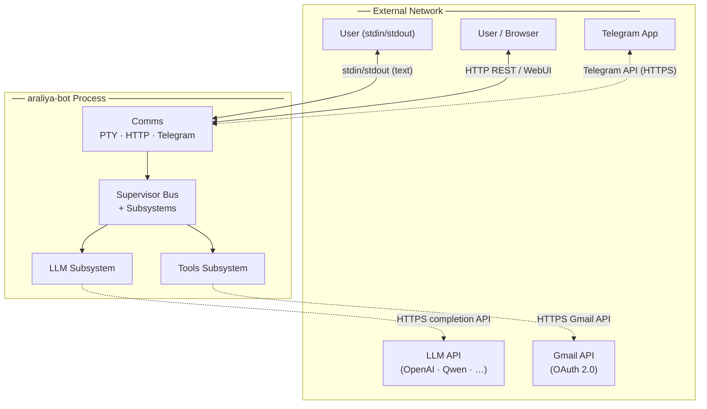

### Internal Bus Topology Diagram (1b)

Internal view: all subsystems within the process, connected via the star-topology Supervisor Bus. All subsystem-to-subsystem traffic flows through the bus hub.

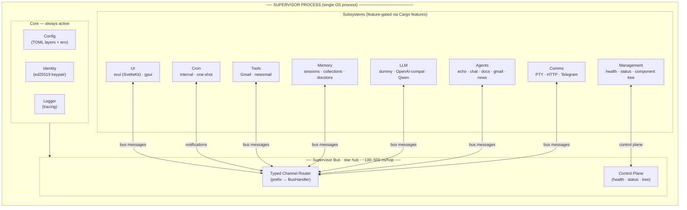

## Supervisor Routing Model

The supervisor dispatches by method prefix and immediately forwards ownership of `reply_tx: oneshot::Sender<BusResult>` to the target subsystem. It does not await the result.

```
Request { method, payload, reply_tx }
  ├─ "agents/*"  → agents.handle_request(method, payload, reply_tx)
  ├─ "llm/*"     → llm.handle_request(method, payload, reply_tx)
  ├─ "cron/*"    → cron.handle_request(method, payload, reply_tx)
  ├─ "manage/*"  → management.handle_request(method, payload, reply_tx)
  ├─ "memory/*"  → memory_bus.handle_request(method, payload, reply_tx)
  ├─ "tools/*"   → tools.handle_request(method, payload, reply_tx)
  └─ unknown     → reply_tx.send(Err(ERR_METHOD_NOT_FOUND))
```

Handlers resolve `reply_tx` directly for synchronous work or from a `tokio::spawn`ed task for async work.

## Startup / Bootstrap Sequence (Diagram 3)

Ordered boot steps from `main.rs`:

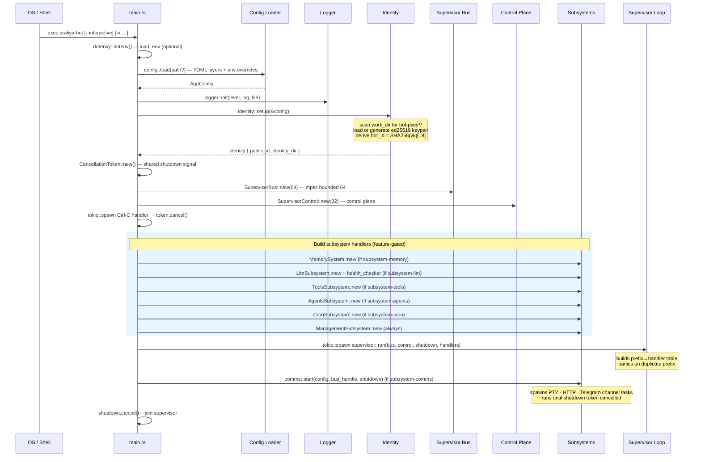

---

# Core Concepts

## Identity System

Each Araliya instance has a persistent **ed25519 keypair**. The keypair is generated on first run and then loaded on every subsequent run. It is the basis for:

- A stable `public_id` that identifies the entity (bot, agent, or subagent)
- (Future) signing outbound events and messages
- (Future) authenticating to external services

### public_id Derivation

`public_id` is the first 8 hex characters of `SHA256(verifying_key_bytes)`.

```
verifying_key_bytes (32 bytes)
  → SHA256 → hex string (64 chars)
  → first 8 chars = public_id
```

Example: `5d16993c`

The `public_id` names the identity directory for the bot:

```
~/.araliya/bot-pkey5d16993c/
```

### File Layout

The identity system is hierarchical. The main bot identity sits at the root, and agent/subagent identities are nested within the bot's memory directory.

```
{work_dir}/
└── bot-pkey{bot_public_id}/
    ├── id_ed25519        32-byte signing key seed (raw bytes, mode 0600)
    ├── id_ed25519.pub    32-byte verifying key (raw bytes, mode 0644)
    └── memory/
        └── agent/
            └── {agent_name}-{agent_public_id}/
                ├── id_ed25519
                ├── id_ed25519.pub
                └── subagents/
                    └── {subagent_name}-{subagent_public_id}/
                        ├── id_ed25519
                        └── id_ed25519.pub
```

### Lifecycle

```
identity::setup(&config)
  ├─ scan work_dir for bot-pkey*/ directory containing id_ed25519
  ├─ if found:
  │   ├─ load id_ed25519 & id_ed25519.pub
  │   ├─ reconstruct verifying key from seed
  │   ├─ verify reconstructed vk == stored pub (integrity check)
  │   └─ return Identity
  └─ if not found:
      ├─ generate new ed25519 keypair (OsRng)
      ├─ compute public_id from verifying key
      ├─ create {work_dir}/bot-pkey{public_id}/
      ├─ save id_ed25519 (mode 0600) & id_ed25519.pub (mode 0644)
      └─ return Identity
```

### Identity Hierarchy Diagram (7)

Each bot instance and each named agent has a persistent ed25519 keypair. `public_id` is derived as `hex(SHA256(verifying_key))[..8]`.

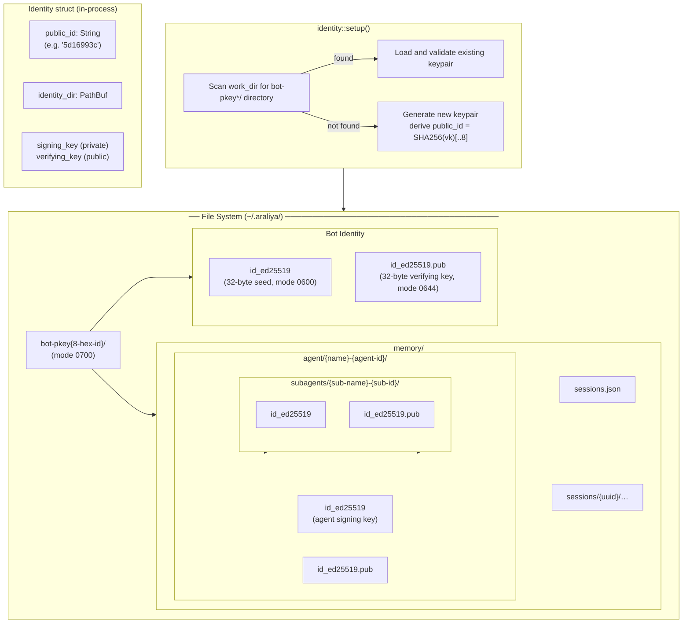

### Security Notes

- The secret key seed (`id_ed25519`) file mode is enforced to `0600` on Unix at creation time
- The key is never logged or printed
- Backup `id_ed25519` to retain identity across machine changes; losing it generates a new identity with a different `public_id`

## Event-Driven Architecture

The bot uses a **central event bus** with a **star topology** for all inter-subsystem communication. Every subsystem is a task within the single-process Tokio runtime, communicating exclusively through the supervisor's typed channel router.

### Why the Event Bus?

- **Non-blocking:** Supervisor loop is a pure router; per-hop overhead ~100–500 ns
- **Centralized:** All communication passes through the hub for logging, cancellation, and permission gating
- **Efficient:** Direct `oneshot` replies bypass the supervisor entirely
- **Scalable:** A single-threaded hub can route ~2–5 M msgs/sec; IPC migration path ready without callsite changes

---

# Configuration Guide

## Config File Structure

Primary config: `config/default.toml` (relative to working directory).

```toml
[supervisor]
bot_name = "araliya"
work_dir = "~/.araliya"
identity_dir = "bot-pkey51aee87e" # optional, absolute path or relative to work_dir
log_level = "info"

[comms.pty]
enabled = true

[comms.telegram]
enabled = false

[comms.http]
enabled = false
bind = "127.0.0.1:8080"

[agents]
default = "basic_chat"

[agents.routing]
# pty0 = "echo"

[agents.chat]
memory = ["basic_session"]
# skills = ["gmail", "newsmail_aggregator"]  # bus tools this agent may invoke

[memory]
# Global memory settings

[memory.basic_session]
# kv_cap = 200
# transcript_cap = 500

[llm]
default = "dummy"

[tools.newsmail_aggregator]
mailbox = "inbox"
n_last = 10
# tsec_last = 86400
```

When `comms.http.enabled = true`, the HTTP channel exposes `GET /health` on `comms.http.bind` and forwards the request to the management bus method `manage/http/get`.

## Launch Profiles (`config/profiles/`)

Named launch configurations live in `config/profiles/`. Each is a **partial overlay** that inherits from `config/default.toml` via `[meta] base = "../default.toml"`. Only the keys that differ from the base are listed.

Example: `config/profiles/full.toml` — all features enabled (Telegram, Gmail, news, docs):

```toml
[meta]
base = "../default.toml"  # path relative to this file

[comms.telegram]
enabled = true

[agents]
default = "chat"
# … only changed entries …
```

To use a profile:

```bash
cargo run -- -f config/profiles/full.toml
cargo run -- -f config/profiles/news.toml
```

Available profiles: `full`, `docker`, `llm-test`, `docs_agent`, `news`, `newsroom`, `runtime_cmd`, `test-gdelt`, `uniweb`.

The loader follows the `base` chain automatically, deep-merging each layer so that overlay keys win and everything else comes from the base.

## Config Inheritance (`[meta] base`)

Any config file can declare a base file it extends:

```toml
[meta]
base = "default.toml"  # relative to *this* file's directory, or absolute
```

### Merge Rules

- **Tables** are merged recursively — only the keys present in the overlay are changed; everything else is inherited.
- **Scalars and arrays** follow the overlay-wins rule.
- **Chains are supported** — the base can itself have a `[meta] base`, creating a stack (grandbase → base → overlay).
- **Circular references** are detected and reported as a config error.
- The `[meta]` table is internal bookkeeping and is stripped before the config is resolved.

### Creating Your Own Overlay

```toml
# config/local.toml
[meta]
base = "default.toml"

[supervisor]
log_level = "debug"

[llm.providers.openai]
model = "gpt-5-nano"
```

```bash
cargo run -- -f config/local.toml
```

## Supervisor Configuration Fields

| Field | Type | Default | Description |
|-------|------|---------|-------------|
| `bot_name` | string | `"araliya"` | Human-readable name for this instance |
| `work_dir` | path | `"~/.araliya"` | Root directory for all persistent data. `~` expands to `$HOME`. |
| `identity_dir` | path (optional) | none | Explicit identity directory. Required to disambiguate when multiple `bot-pkey*` dirs exist. |
| `log_level` | string | `"info"` | Log verbosity: `error`, `warn`, `info`, `debug`, `trace` |

## Comms Configuration

| Field | Type | Default | Description |
|-------|------|---------|-------------|
| `comms.pty.enabled` | bool | `true` | Enables PTY (console) channel. Only active when `-i` / `--interactive` is passed at runtime. |
| `comms.telegram.enabled` | bool | `false` | Enables Telegram channel (requires `TELEGRAM_BOT_TOKEN`). |
| `comms.http.enabled` | bool | `false` | Enables HTTP channel with API and UI serving. |
| `comms.http.bind` | string | `"127.0.0.1:8080"` | TCP bind address for HTTP channel listener. |

## HTTP API Routes

| Path | Description |
|------|-------------|
| `GET /` | Root welcome page (always available, even without UI subsystem). |
| `GET /api/health` | JSON health status from management bus. |
| `GET /api/tree` | Component tree JSON (no private data) |
| `/ui/*` | Delegated to the UI backend when `ui.svui.enabled = true`. |
| `GET /preview/{session_id}/{*path}` | Serves webbuilder workspace `dist/` files (requires `plugin-webbuilder`). |

## UI Configuration

| Field | Type | Default | Description |
|-------|------|---------|-------------|
| `ui.svui.enabled` | bool | `true` | Enables the Svelte-based web UI backend. |
| `ui.svui.static_dir` | string (optional) | none | Path to the static build directory. Relative to the bot's working directory. If absent, a built-in placeholder is served. |

The UI is a SvelteKit SPA built with shadcn-svelte, served at `/ui/`.

## Agents Configuration

The agents subsystem routes inbound messages to registered agents. Every agent has an explicit **runtime class** that describes its execution model.

| Runtime class | Execution model |
|---|---|
| `request_response` | Stateless single-turn exchange — no session state. |
| `session` | Persistent multi-turn conversation with transcript memory. |
| `agentic` | Bounded multi-step orchestration: instruction → tools → response. |
| `specialized` | Built-in agents with specific delegation or passthrough patterns. |

### Core Settings

| Field | Type | Default | Description |
|---|---|---|---|
| `agents.default` | string | `"basic_chat"` | Agent that handles messages with no explicit routing. |
| `agents.enabled` | array<string> | `[]` | Agent IDs reachable via routing. Empty list = all agents reachable. |
| `agents.debug_logging` | bool | `false` | Write per-turn debug data to session KV for all agentic agents. |

### Routing

| Field | Type | Default | Description |
|---|---|---|---|
| `agents.routing` | map<string, string> | `{}` | Channel ID → Agent ID overrides. Takes priority over default. Example: `pty0 = "echo"`. |

### Per-Agent Settings

| Field | Type | Default | Description |
|---|---|---|---|
| `agents.{id}.enabled` | bool | `true` | Set to `false` to disable agent without removing config. |
| `agents.{id}.memory` | array<string> | `[]` | Memory store types this agent requires. Example: `["basic_session"]`. |
| `agents.{id}.skills` | array<string> | `[]` | Bus tools this agent may invoke. |

---

# Subsystems Reference

## Overview

The bot is composed of independent subsystems that provide specific capabilities. Each subsystem is a Tokio task within the single-process runtime, communicating exclusively through the supervisor bus.

Subsystems are:
- **Feature-gated** at compile time (can be disabled to reduce binary size)
- **Pluggable** — enabled/disabled at startup via config
- **Non-blocking** — all I/O is async; the supervisor loop is never blocked

## Agents Subsystem

**Version:** v0.7 — runtime-classified agents, unified agent trait, agentic-loop orchestration model, session memory, per-turn debug logging.

### Overview

The Agents subsystem is the policy and execution layer of the bot. It receives agent-targeted requests from the supervisor bus, resolves which agent should handle each request, and delegates execution to that agent's runtime.

An agent is not just a function — it is a named entity that couples:

- A stable cryptographic identity and identity-bound working area
- Memory stores (sessions, transcripts, key-value data)
- Prompt files that define behavioral policy
- A declared set of tools it may invoke
- Access to one or more LLM completion paths
- I/O routing from comms channels
- A **runtime class** that defines its execution model

### Runtime Classes

The runtime class describes how an agent processes work — not what it does, but the shape in which it does it.

#### RequestResponse

A `RequestResponse` agent handles a single inbound message and produces a single reply. No session state is created or required. Execution is synchronous.

Built-in agents: `echo`, `basic_chat`

#### Session

A `Session` agent maintains persistent conversation state across turns. Each interaction belongs to a session identified by a session ID. Session agents persist a transcript of user and assistant messages.

Built-in agents: `chat`

#### Agentic

An `Agentic` agent runs a bounded multi-step orchestration loop on each request. The typical sequence is: instruction pass (tool selection), tool execution, context assembly, and response pass. The agent may use session memory to persist state across requests.

Built-in agents: `agentic-chat`, `docs`, `webbuilder`

#### Specialized

`Specialized` is a transitional runtime class for built-in agents whose execution model does not cleanly map to the above. These agents use specific delegation and passthrough patterns.

Built-in agents: `news`, `gmail`, `gdelt_news`, `runtime_cmd`

### Built-in Agents

| Agent ID | Runtime class | Role |
|---|---|---|
| `echo` | `RequestResponse` | Stateless echo; safety fallback |
| `basic_chat` | `RequestResponse` | Single-turn LLM pass-through |
| `chat` | `Session` | Multi-turn session-aware conversation |
| `agentic-chat` | `Agentic` | Dual-model instruction → tool → response |
| `docs` | `Agentic` | RAG or KG-RAG document QA |
| `news` | `Specialized` | News email fetch and LLM summarization |
| `gmail` | `Specialized` | Gmail read via tool delegation |
| `gdelt_news` | `Specialized` | GDELT BigQuery news fetch and summarization |
| `runtime_cmd` | `Specialized` | Direct passthrough to external runtime |
| `webbuilder` | `Agentic` | Iterative Svelte page builder |

### Chat Workflow Diagrams

#### Stateless Chat (4a) — basic_chat Agent

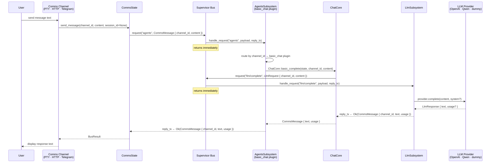

#### Session-Aware Chat (4b) — chat Agent with Memory

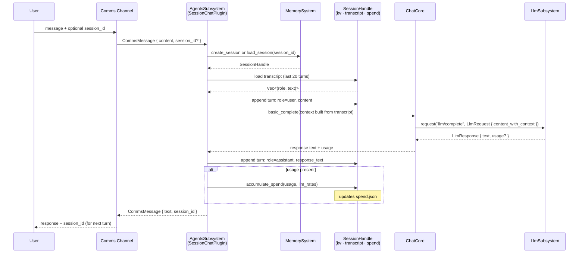

### Routing

Agents are resolved from the inbound request in this priority order:

1. **Explicit agent ID** from the method path (e.g. `agents/chat/handle`)
2. **Channel mapping** — `channel_id → agent_id` override from `[agents.routing]` in config
3. **Default agent** — the agent named in `agents.default`, provided it is in the `enabled` set

### AgenticLoop — Shared Orchestration

`AgenticLoop` is the orchestration engine for multi-step agent plugins (`agentic-chat` and `docs`). It implements a three-phase execution model per request:

**Phase 1 — Instruction pass**

The agent renders an instruction prompt including the user message, tool manifest, and available memory sources. The response is parsed as JSON array of `{tool, action, params}` objects.

**Phase 2 — Tool execution**

Each parsed tool call is dispatched. Outputs are collected into a context string.

**Phase 3 — Response pass**

Context from tool execution, recent conversation history, and the original user message are combined into a response prompt. The reply is returned with the session ID attached.

## LLM Subsystem

**Status:** v0.2.0-alpha — provider pool, runtime provider switch, per-request overrides, symbolic route hints, unknown api_type catch-all, `LlmResponse.thinking`, `LlmUsage.reasoning_tokens`, streaming support.

### Overview

The LLM subsystem is a bus participant that handles all `llm/*` requests. It owns a **pool** of named providers (all `[llm.providers.*]` entries built at startup) and resolves each request asynchronously.

### LLM Types

```rust
pub struct LlmUsage {
    pub input_tokens: u64,
    pub output_tokens: u64,
    pub cached_input_tokens: u64,
    pub reasoning_tokens: u64,
}

pub struct ModelRates {
    pub input_per_million_usd: f64,
    pub output_per_million_usd: f64,
    pub cached_input_per_million_usd: f64,
}

pub struct LlmResponse {
    pub text: String,
    pub thinking: Option<String>,  // reasoning_content (Qwen3, QwQ, DeepSeek-R1)
    pub usage: Option<LlmUsage>,
}

pub enum StreamChunk {
    Thinking(String),
    Content(String),
    Done(Option<LlmUsage>),
}
```

### Bus Methods

| Method | Description |
|--------|-------------|
| `llm/complete` | Buffered completion — waits for the full response. |
| `llm/instruct` | Instruction pass (SLM router) — routes to `[llm.instruction]` provider. |
| `llm/stream` | Streaming completion — emits `StreamChunk`s as they arrive. |
| `llm/list_providers` | Enumerate provider pool. |
| `llm/set_default` | Switch active provider at runtime. |
| `llm/{name}/status` | Provider-scoped status. |

### Provider Abstraction

`LlmProvider` is an enum over concrete implementations:

- `DummyProvider` — returns `[echo] {input}`
- `ChatCompletionsProvider` — OpenAI-compatible `/v1/chat/completions` with SSE streaming
- `OpenAiResponsesProvider` — OpenAI Responses API wire format with reasoning extraction

Adding a backend = new module + new variant + new match arms.

## Memory Subsystem

**Status:** v0.2.0-alpha — typed value model, session lifecycle, pluggable stores, `BasicSessionStore`, `TmpStore`, optional `SqliteStore`, optional `IDocStore`, optional `IKGDocStore`.

### Overview

The Memory subsystem owns all session data for the bot instance. It provides:

- A **typed value model** for structured, hashable agent memory
- Two concrete **collection types** (`Doc` for scalars, `Block` for rich payloads)
- A **`TmpStore`** — ephemeral in-process storage, ideal for scratch pads
- A **`BasicSessionStore`** — disk-backed JSON + Markdown transcript
- A **`SessionHandle`** — async-safe handle agents use to read/write session state

### Session Lifecycle

Sessions are **bot-scoped** — any agent with the session ID can access it.

1. **Create:** `MemorySystem::create_session(&["tmp"], "chat")` or `&["basic_session"]`
2. **Use:** Returns a `SessionHandle` for k-v and transcript operations
3. **Load:** `MemorySystem::load_session(session_id, "chat")` re-opens an existing session

Session IDs are UUIDv7 (time-ordered). The `sessions.json` index tracks all sessions.

### Data Layout (Disk-backed Sessions)

```
{identity_dir}/
└── memory/
    ├── sessions.json              session index
    └── sessions/
        └── {uuid}/
            ├── kv.json            capped k-v store
            ├── transcript.md      capped Markdown transcript
            └── spend.json         token and cost totals
```

### Optional Stores

| Store | Feature | Purpose |
|-------|---------|---------|
| `SqliteStore` | `isqlite` | Agent-scoped SQLite databases for structured data |
| `IDocStore` | `idocstore` | Document indexing with BM25 search |
| `IKGDocStore` | `ikgdocstore` | KG-augmented document store with graph traversal |

### Runtime Memory Structures Diagram (6a)

API surface and in-process data structures. Dashed borders indicate feature-gated components.

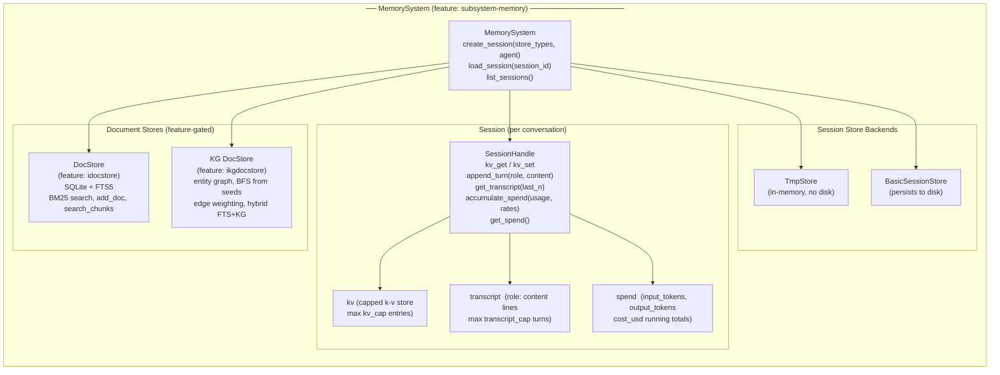

### Disk Persistence Layout Diagram (6b)

How `BasicSessionStore` and the document stores map to files on disk. The `TmpStore` backend writes nothing.

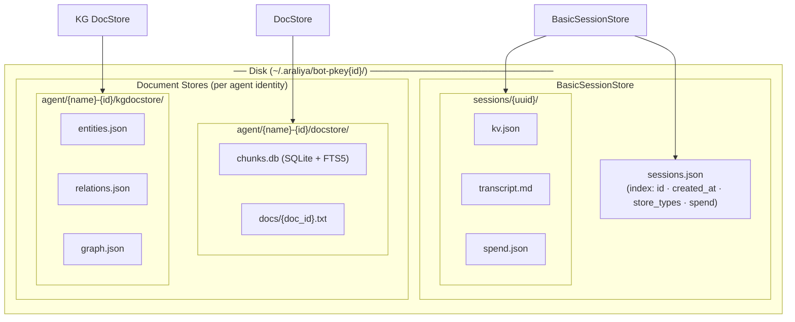

## Comms Subsystem

**Status:** v0.8.0 — concurrent channel tasks, capability boundary, intra-subsystem event queue, PTY runtime conditional, Axum channel with full `/api/` surface, SSE streaming, thinking field threading, Telegram channel.

### Overview

The Comms subsystem manages all external I/O for the bot. It provides multiple transport layers (PTY, HTTP, Telegram) and hosts pluggable **channel plugins**.

### Channels

#### PTY Layer

- Console I/O (stdin/stdout)
- Enabled by config in interactive runs
- Auto-disabled when supervisor stdio adapter owns stdio
- Multiple PTY instances supported (e.g. `pty0`, `pty1`)
- Used for local testing and development

#### HTTP Layer (Axum)

- axum/hyper-based on configurable bind address (default `127.0.0.1:8080`)
- Full `/api/` surface with health, tree, sessions, agents, messaging
- **SSE streaming** via `POST /api/message/stream`
- Non-API paths delegated to UI backend or 404

#### Telegram Channel

- teloxide-based integration with Telegram Bot API
- Token-based authentication (`TELEGRAM_BOT_TOKEN` env var)
- Concurrent dispatcher with graceful shutdown

### Channel Architecture Diagram (5a)

Channels and the `CommsState` capability surface. All user-facing I/O enters and exits the process through channels; the bus is the only communication path inward.

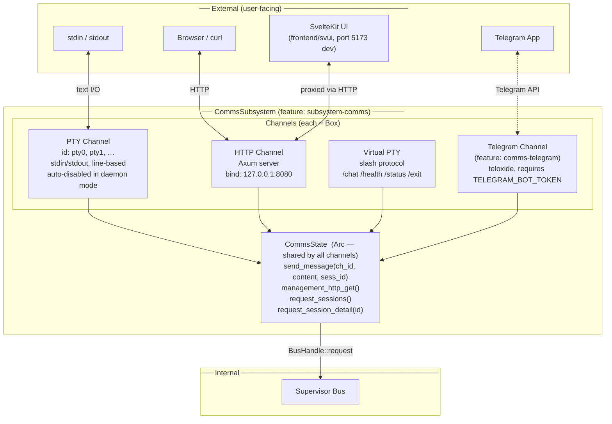

### API Routes

| Path | Description |
|------|-------------|
| `GET /api/health` | Enriched health JSON |
| `POST /api/health/refresh` | Trigger live subsystem health re-check |
| `GET /api/tree` | Component tree JSON |
| `POST /api/message` | Buffered chat response |
| `POST /api/message/stream` | **SSE streaming** |
| `GET /api/sessions` | Session list |
| `GET /api/agents` | Agent list |
| `GET /api/session/{session_id}` | Session detail |

### HTTP API and UI Integration Diagram (5b)

REST routes served by the Axum HTTP channel, and how the SvelteKit frontend integrates.

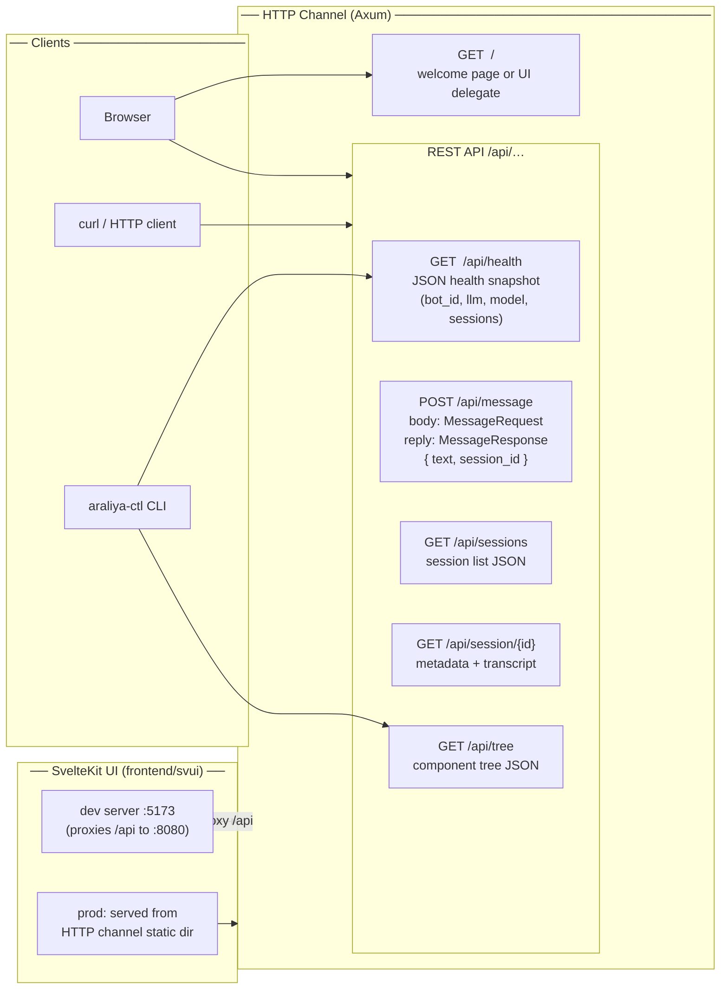

## Tools Subsystem

**Status:** Implemented — Gmail, GDELT BigQuery, RSS, newsmail aggregator.

### Overview

The Tools subsystem owns tool execution on behalf of agents. Agents call the tools subsystem through the supervisor bus.

### Built-in Tools

| Tool | Actions | Purpose |
|------|---------|---------|
| `gmail/read_latest` | Gmail integration with OAuth 2.0 |
| `newsmail_aggregator/get` | Fetch and aggregate recent emails |
| `gdelt_bigquery/fetch` | GDELT v2 BigQuery event retrieval |

### Per-Agent Tool Scoping

Bus tools are not globally visible. Each agent declares which tools it may invoke via `skills = [...]` in its config section. Only declared tools appear in the instruction-pass manifest.

```toml
[agents.agentic-chat]
skills = ["gmail", "newsmail_aggregator"]

[agents.docs]
# skills = []  # default — no bus tools
```

## Cron Subsystem

**Status:** Implemented — timer-based event scheduling, priority queue, no polling.

### Overview

The cron subsystem provides timer-based event scheduling. Other subsystems schedule events by sending bus requests; the cron service emits those events as bus notifications at the specified times.

### Bus Methods

| Method | Description |
|--------|-------------|
| `cron/schedule` | Schedule a new timed event |
| `cron/cancel` | Cancel an active schedule |
| `cron/list` | List all active schedules |

### Timer Implementation

- **Priority queue:** `BTreeMap<Instant, ScheduleEntry>` sorted by next fire time
- **Secondary index:** `HashMap<String, Instant>` for O(1) cancel
- **Sleep strategy:** `tokio::time::sleep_until(next_deadline)` — no polling
- **Collision handling:** Entries at the same `Instant` are nudged forward by 1ns

### Schedule Specs

| Variant | Fields | Behaviour |
|---------|--------|-----------|
| `Once` | `at_unix_ms: u64` | Fire once at the given UTC timestamp, then remove |
| `Interval` | `every_secs: u64` | Fire repeatedly at the given interval from now |

## UI Subsystem

**Status:** v0.2.0-alpha — `UiServe` trait, `svui` backend, static file serving with SPA fallback, built-in placeholder.

### Overview

The UI subsystem provides display-oriented interface backends. Unlike comms or agents, it does not run independent tasks. Instead it constructs a `UiServeHandle` — a trait-object that the HTTP channel calls per-request.

### svui Backend

Svelte-based web UI backend. Serves static files from a build directory, or a built-in placeholder page when unavailable.

| Condition | Result |
|-----------|--------|
| `static_dir` configured and exists | Files served from disk; SPA fallback to `index.html` |
| `static_dir` absent or missing | Built-in placeholder HTML page served |
| Path contains `..` | Rejected with 400 Bad Request |

## Document Stores

### Intelligent Document Store (IDocStore)

**Feature:** `idocstore`

Provides document indexing, chunking, and BM25 text search.

**Features:**
- Document ingestion with SHA-256 deduplication
- Fixed-size chunking with byte-position tracking
- Full-text indexing via SQLite FTS5
- BM25 ranking for relevance-sorted results
- Persistent metadata

### Knowledge-Graph Document Store (IKGDocStore)

**Feature:** `ikgdocstore`

Layers a knowledge graph on top of the indexed backend for richer RAG context.

**Features:**
- All IDocStore features
- Entity extraction and relation discovery
- BFS graph traversal at query time
- KG+FTS merged context assembly
- Pure FTS fallback when KG is absent

### SQLite Store (SqliteStore)

**Feature:** `isqlite`

General-purpose agent-scoped SQLite database with minimal API.

**Features:**
- Multiple named databases per agent
- DDL setup and schema migration helpers
- Typed query pipeline (SELECT / DML)
- LocalTool wrappers for LLM agents

---

# Standards & Protocols

## Bus Protocol

**Status:** Implemented

The supervisor event bus is the communication channel between subsystems. This document specifies the protocol every subsystem participant must follow.

### Design Basis

The protocol follows **JSON-RPC 2.0 semantics** — request/response correlation by `id`, structured error objects with numeric codes, and clear separation between requests (expecting a reply) and notifications (fire-and-forget).

### Method Naming

Method strings use `/`-separated path segments:

```
"subsystem/component/action"
```

Examples:
- `"agents"` — agents subsystem, default component, default action
- `"agents/echo/handle"` — explicit agent + action
- `"llm/complete"` — LLM subsystem, complete action

The supervisor dispatches by the **first segment only**. Everything after the first `/` is passed verbatim to the handler.

### Message Kinds

```rust
pub enum BusMessage {
    Request {
        id: Uuid,
        method: String,
        payload: BusPayload,
        reply_tx: oneshot::Sender<BusResult>,
    },
    Notification {
        method: String,
        payload: BusPayload,
    },
}
```

**Request:** Caller awaits exactly one reply via the embedded `oneshot::Sender<BusResult>`.

**Notification:** Fire-and-forget. Lossy under back-pressure — if the bus buffer is full, the notification is dropped.

### Request / Response Flow Diagram (2a)

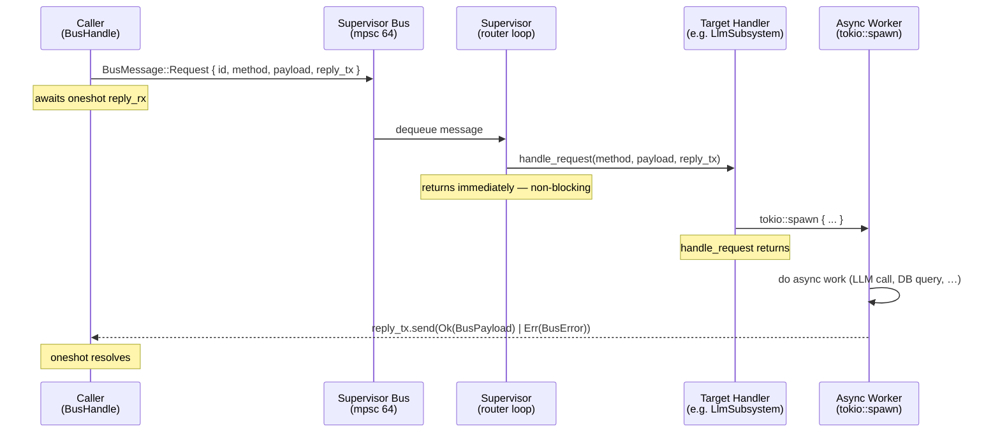

### Notification Flow Diagram (2b)

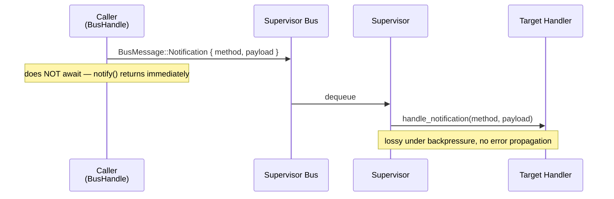

### Method Grammar Diagram (2c)

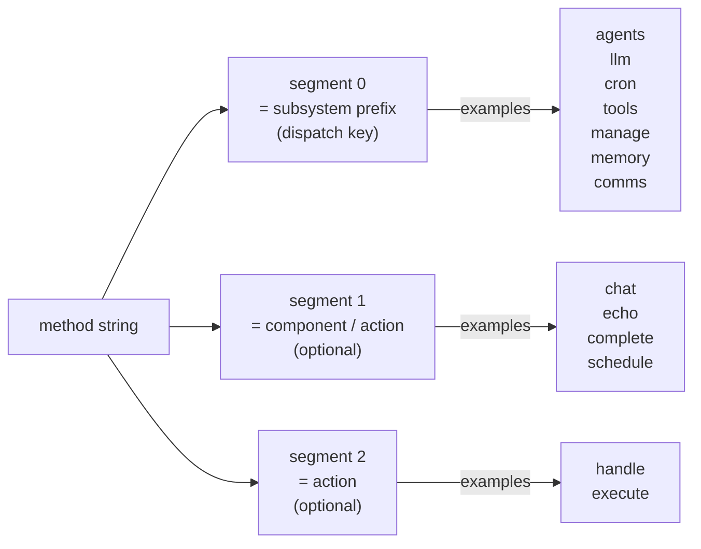

### BusPayload Variants

```rust
pub enum BusPayload {
    CommsMessage { channel_id, content, session_id, usage, thinking },
    LlmRequest { channel_id, content, system },
    LlmStreamResult { rx: StreamReceiver },
    CancelRequest { id },
    SessionQuery { session_id },
    JsonResponse { data },
    Empty,
}
```

#### BusPayload Class Diagram (2d)

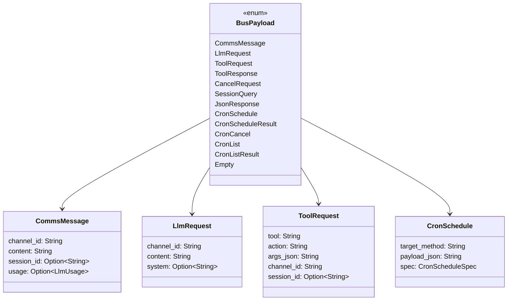

### Error Codes

```rust
pub const ERR_METHOD_NOT_FOUND: i32 = -32601;  // JSON-RPC 2.0 compatible
```

Application-level errors use range `-32000` to `-32099`.

### BusHandler Registration Contract

Each subsystem implements `BusHandler`:

```rust
pub trait BusHandler: Send + Sync {
    fn prefix(&self) -> &str;
    fn handle_request(&self, method: &str, payload: BusPayload, reply_tx: oneshot::Sender<BusResult>);
    fn handle_notification(&self, _method: &str, _payload: BusPayload) {}
}
```

Rules:
- `prefix()` must be unique (supervisor panics if duplicate)
- `handle_request` receives the **full method string**
- Neither method may block the caller — offload async work to `tokio::spawn`

### Key Types Architecture Diagram (8)

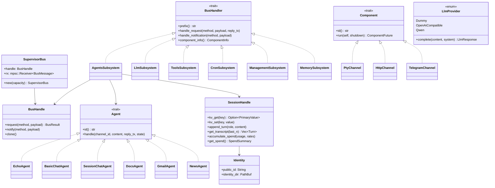

---

# Development Guide

## Prerequisites

- Rust toolchain 1.80+ (`rustup`)
- `cargo` (bundled with Rust)

## Workflow

```bash
# Check compilation (fast)
cargo check

# Run tests
cargo test

# Build
cargo build

# Run
cargo run
```

**Always run `cargo check` and `cargo test` before committing changes.**

## Code Style

- **One concern per module** — `config.rs` only loads config, `identity.rs` only manages identity
- **`main.rs` is an orchestrator only** — no business logic
- **Errors via `thiserror`** — no `unwrap()` in non-test code, no `Box<dyn Error>` in public APIs
- **Logging via `tracing` macros** — use `info!`, `debug!`, `warn!`, `error!`; not `println!`
- **PTY user-facing console I/O** is the exception and may write to stdout/stderr directly

## Adding a New Module

1. Create `src/{name}.rs`
2. Declare it in `main.rs`: `mod {name};`
3. Define a typed error variant in `error.rs` if needed
4. Add unit tests in a `#[cfg(test)]` block at the bottom
5. Use `tempfile::TempDir` for filesystem tests

## Documentation

Update the relevant doc in `docs/` when making significant changes. Keep `docs/architecture/overview.md` current.

---

# Testing & Quality

## Running Tests

```bash
cargo test
```

## Test Coverage (v0.2.0-alpha)

Run all tests:

```bash
cargo test --workspace               # ~318 tests
```

### Per-Crate Breakdown

| Crate | Tests | Notes |
|-------|-------|-------|
| `araliya-core` | 44 | config, identity, error, logger |
| `araliya-supervisor` | 6 | dispatch loop, control plane |
| `araliya-llm` | 10 | provider dispatch |
| `araliya-comms` | 4+ | comms state |
| `araliya-memory` | 64–91 | with optional features |
| `araliya-cron` | 4 | timer service |
| `araliya-agents` | varies | feature-gated plugin tests |
| `araliya-bot` | 142+ | integration, subsystem wiring |

### Feature-Gated Tests

Feature-gated tests require explicit flags:

```bash
cargo test -p araliya-memory --features "isqlite,idocstore,ikgdocstore"
cargo test --features idocstore
cargo test --features ikgdocstore
```

## Filesystem Tests

All tests use `tempfile::TempDir`. Tests never write to `~/.araliya` or shared paths.

```rust
use tempfile::TempDir;

let tmp = TempDir::new().unwrap();
let cfg = Config { work_dir: tmp.path().to_path_buf(), .. };
let identity = identity::setup(&cfg).unwrap();
// tmp cleaned up when it goes out of scope
```

## Env Var Tests

Config tests verify override behaviour by passing values directly, not mutating env vars:

```rust
// Pass override directly — no env mutation
let cfg = load_from(f.path(), Some("/tmp/override"), None).unwrap();
assert_eq!(cfg.work_dir, PathBuf::from("/tmp/override"));
```

## CI

`.github/workflows/ci.yml` runs on every push and PR:

```bash
cargo fmt --check
cargo clippy --workspace --all-targets --all-features -- -D warnings
cargo test --workspace
```

---

# Deployment & Operations

## Development Mode

```bash
cd araliya-bot
cargo run
```

Logs go to stderr. Data goes to `~/.araliya/`.

```bash
# Verbose output
RUST_LOG=debug cargo run

# Custom data directory
ARALIYA_WORK_DIR=/tmp/araliya-dev cargo run
```

## Docker

### Quick Start

```bash
# Copy and edit the env file with your API keys
cp .env.example .env
$EDITOR .env

# Build and run (data persisted in ./data/)
docker compose up --build
```

The HTTP/axum channel is available at `http://localhost:8080`.

### Environment Variables

| Variable | Default | Purpose |
|---|---|---|
| `ARALIYA_WORK_DIR` | `/data/araliya` | Persistent state (identity, memory) |
| `ARALIYA_HTTP_BIND` | `0.0.0.0:8080` | Bind address for HTTP/axum channel |
| `ARALIYA_LOG_LEVEL` | *(from config)* | Log level override |
| `OPENAI_API_KEY` | *(none)* | API key for configured LLM provider |
| `TELEGRAM_BOT_TOKEN` | *(none)* | Telegram bot token |

### Persistent Data

Mount a host directory or named volume over `/data/araliya` to preserve identity across restarts:

```yaml
volumes:
  - ./data:/data/araliya           # host-directory bind mount
  # or
  - araliya_data:/data/araliya     # named Docker volume
```

### Building Manually

```bash
docker build -t araliya-bot:latest .
docker run --rm \
  -p 8080:8080 \
  -v "$(pwd)/data:/data/araliya" \
  -e OPENAI_API_KEY=sk-... \
  araliya-bot:latest
```

## Production (Single Machine)

### One-line Install (Recommended)

```bash
curl -fsSL https://raw.githubusercontent.com/xcorat/araliya-bot/main/install.sh | bash
```

`install.sh` auto-detects arch (Linux x86_64 / aarch64), resolves the latest GitHub release, downloads the tarball, installs the binary to `~/.local/bin/`, and seeds config.

### Override Defaults

| Variable | Default | Purpose |
|---|---|---|
| `ARALIYA_TIER` | `default` | Feature tier: `minimal`, `default`, or `full` |
| `ARALIYA_VERSION` | latest | Pin to a specific release tag |
| `INSTALL_DIR` | `~/.local/bin` | Binary installation directory |
| `ARALIYA_CONFIG_DIR` | `~/.config/araliya` | Config directory |
| `ARALIYA_WORK_DIR` | `~/.araliya` | Runtime data directory |

### After Installation

Run the interactive setup wizard:

```bash
araliya-bot setup   # LLM provider, agent profile, channels
araliya-bot doctor  # validate config before first run
araliya-bot         # start the bot
```

---

## Appendix: Decentralized Infrastructure (RustDHT Integration)

**Araliya Bot & RustDHT: Self-Sovereign AI Swarms**

### Vision

The integration of **Araliya Bot** (a modular, Rust-based agentic AI framework) with **RustDHT** (a decentralized, WebRTC-based P2P graph database) represents a fundamental reimagining of AI infrastructure. By combining Araliya's autonomous agent capabilities with RustDHT's community-owned, censorship-resistant network, we enable the creation of **Self-Sovereign AI Swarms**.

This hybrid architecture ensures:
- **Users own their AI's memory:** Data is cryptographically signed and distributed across a peer-to-peer network
- **Agents collaborate without intermediaries:** Direct peer-to-peer communication eliminates gatekeepers
- **Infrastructure scales organically:** As more agents join, storage and bandwidth increase

### Core Architecture Integration

The integrated system operates on a hybrid model, bridging Araliya's internal event bus with RustDHT's global, decentralized network.

#### The Hybrid Approach

1. **The Supervisor as a P2P Node:** The Araliya Bot supervisor embeds a RustDHT node, participating in the global DHT while managing local subsystems via its internal event bus.

2. **Bridging the Event Bus:** A new `channel-p2p` module within Araliya's `comms` subsystem acts as a bridge, translating internal Araliya events into libp2p GossipSub messages and vice versa.

3. **CRDT-Backed Memory:** Araliya's `memory` subsystem is augmented to use RustDHT's Conflict-Free Replicated Data Type (CRDT) graph, replacing or supplementing the local `basic_session` store.

#### Identity & Cryptographic Ownership

Araliya's existing `ed25519` keypair generation maps perfectly to RustDHT's ownership model:
- **Unified Identity:** The `ed25519` private key signs all local agent actions
- **Data Sovereignty:** When an agent writes to the DHT, it signs the CRDT operation. Only the owner can mutate that subgraph

#### Resilient Agent Memory

For single users running Araliya across multiple devices:
- **Distributed Graph:** Agent context, preferences, and history are stored as nodes/edges in the RustDHT graph
- **Offline-First:** The agent continues functioning offline, writing to its local RustDHT shard
- **Automatic Merging:** Upon reconnection, CRDT HAM algorithm automatically merges concurrent edits

#### Swarm Collaboration

Beyond single-agent memory, multi-agent swarms can collaborate:
- **Peer Discovery:** Agents use the DHT to discover other agents offering specific skills
- **GossipSub Messaging:** Real-time coordination via libp2p GossipSub topics
- **Permissionless Innovation:** Developers build specialized agents that seamlessly join the swarm

### Technology Stack

- **Rust & WebAssembly:** Memory safety and performance; WASM for browser compatibility
- **libp2p & WebRTC:** Modular, transport-agnostic networking
- **CRDTs:** Mathematical guarantees for eventual consistency
- **Local & Edge LLMs:** Complete independence from corporate infrastructure

### Tradeoffs & Engineering Challenges

#### Latency vs. Decentralization
- **Challenge:** DHT retrieval can take hundreds of milliseconds vs. microseconds for local SQLite
- **Mitigation:** Aggressive local caching and predictive pre-fetching

#### Eventual Consistency vs. Strict State
- **Challenge:** CRDTs guarantee *eventual* consistency, not immediate
- **Mitigation:** Design agent logic to be idempotent and fault-tolerant

#### Resource Constraints
- **Challenge:** Running LLM + event bus + full DHT node simultaneously is resource-intensive
- **Mitigation:** Support "light client" modes with selective replication

---

**End of Documentation**

---

**For more information, see:**
- [DOCUMENTATION-MAP.md](DOCUMENTATION-MAP.md) — Organized navigation guide
- [GitHub Repository](https://github.com/xcorat/araliya-bot)
- Individual docs in `docs/` folder
