# Architecture Diagrams

This document provides a visual reference for the araliya-bot system architecture.
All diagrams are written in [Mermaid](https://mermaid.js.org/) and render natively
on GitHub and in most Markdown viewers.

---

## How to Draw / Automate Diagrams

Mermaid was chosen for the following reasons:

| Property | Mermaid | Draw.io / Lucidchart | PlantUML |
|---|---|---|---|
| **Version-controlled as text** | ✅ | ❌ (binary XML) | ✅ |
| **Rendered natively on GitHub** | ✅ | ❌ | ❌ |
| **No external tooling to view** | ✅ | ❌ | ❌ |
| **Automatable / codegen-friendly** | ✅ | partial | ✅ |
| **Interactive / styled exports** | partial | ✅ | partial |

To **edit** diagrams: modify this `.md` file directly — GitHub renders them on
the PR/commit view. For local previews, use the
[Mermaid Live Editor](https://mermaid.live) or the VS Code Mermaid extension.

To **export** to SVG/PNG for slides or external documentation, paste a diagram
block into [mermaid.live](https://mermaid.live) and use the download button, or
run the [Mermaid CLI](https://github.com/mermaid-js/mermaid-cli):

```
npx -p @mermaid-js/mermaid-cli mmdc -i diagrams.md -o out/ -e svg
```

To **automate** diagram updates, a future CI step can regenerate diagrams by
rendering all Mermaid blocks in this file to `docs/architecture/generated/`.

---

## Diagram Index

1. [System Overview](#1-system-overview)
2. [Bus Message Protocol](#2-bus-message-protocol)
3. [Startup / Bootstrap Sequence](#3-startup--bootstrap-sequence)
4. [Chat Workflow (end-to-end)](#4-chat-workflow-end-to-end)
5. [Comms Subsystem and Channels](#5-comms-subsystem-and-channels)
6. [Memory System](#6-memory-system)
7. [Identity Hierarchy](#7-identity-hierarchy)
8. [Component Runtime and Fail-fast](#8-component-runtime-and-fail-fast)

---

## 1. System Overview

High-level structure of the single-process supervisor model.  
All subsystems run as Tokio tasks within one OS process and communicate
**exclusively** through the Supervisor Bus (star topology).

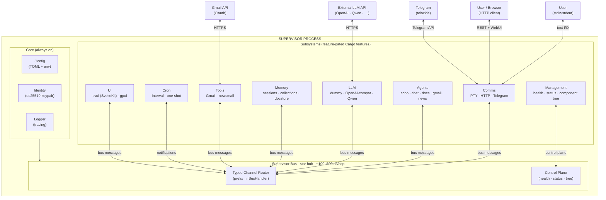

---

## 2. Bus Message Protocol

The bus follows **JSON-RPC 2.0 semantics** in-process. Two message kinds:
- **Request** — caller expects exactly one reply via a `oneshot` channel.
- **Notification** — fire-and-forget; no reply expected.

### 2a. Request / Response Flow

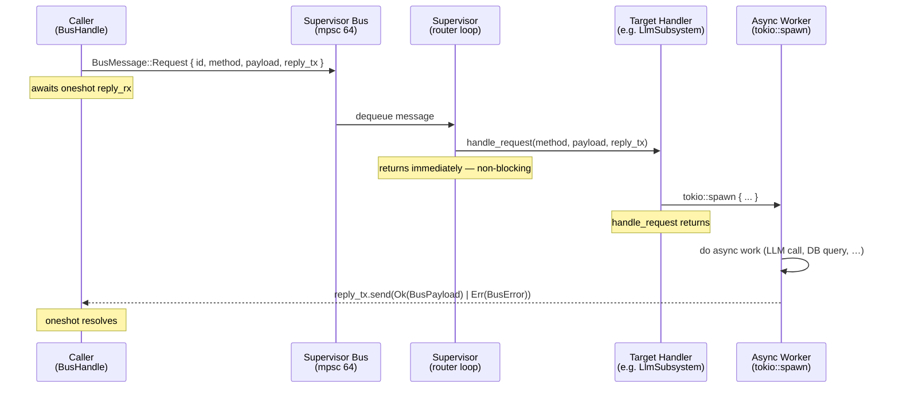

### 2b. Notification Flow

```mermaid
sequenceDiagram
    participant Caller as Caller<br/>(BusHandle)
    participant Bus as Supervisor Bus
    participant Sup as Supervisor
    participant Handler as Target Handler

    Caller->>Bus: BusMessage::Notification { method, payload }
    Note over Caller: does NOT await — notify() returns immediately
    Bus->>Sup: dequeue
    Sup->>Handler: handle_notification(method, payload)
    Note over Sup,Handler: lossy under backpressure; no error propagation
```

### 2c. Method Grammar

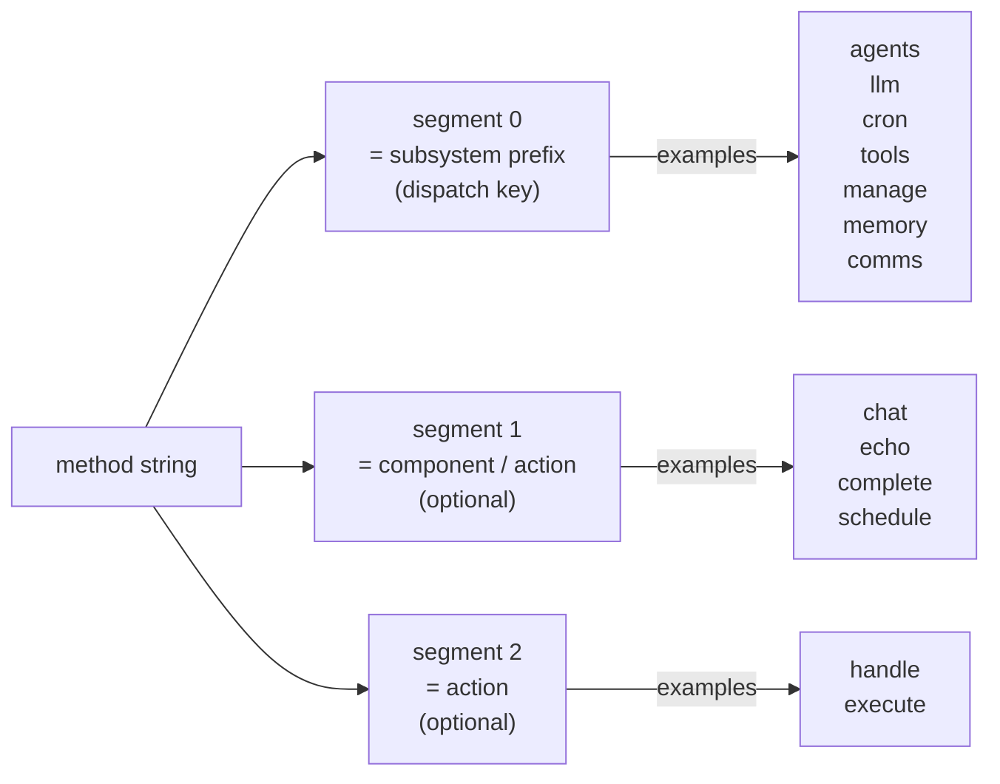

### 2d. BusPayload Variants

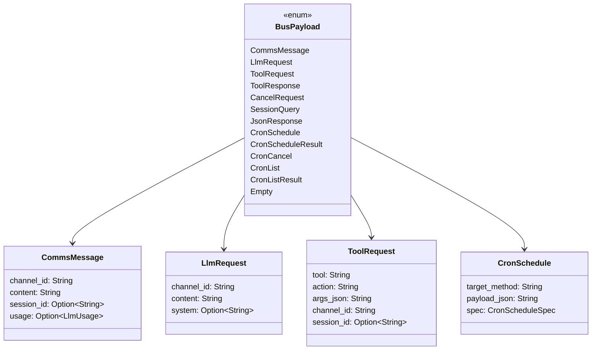

---

## 3. Startup / Bootstrap Sequence

Ordered boot steps from `main.rs`.

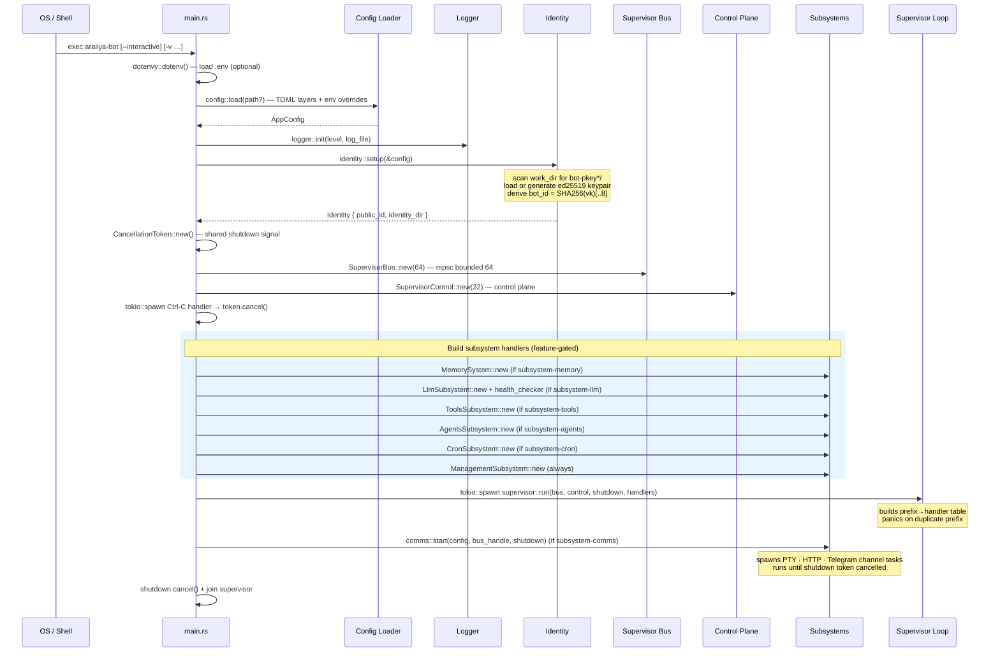

---

## 4. Chat Workflow (end-to-end)

Two variants: stateless **basic_chat** and session-aware **chat** (with memory).

### 4a. Stateless Chat (basic_chat agent)

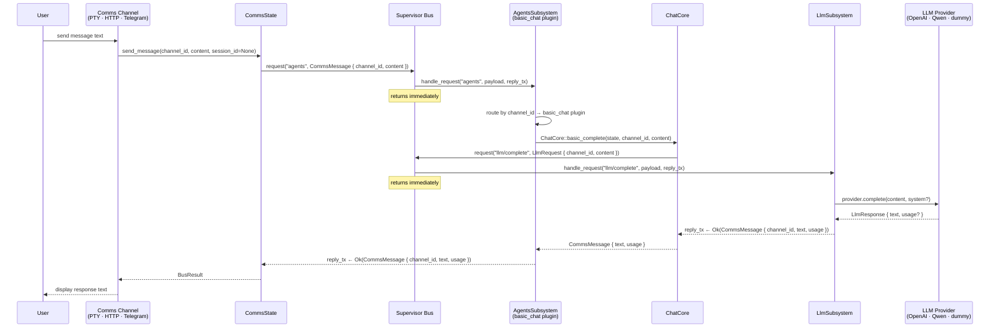

### 4b. Session-Aware Chat (chat agent with memory)

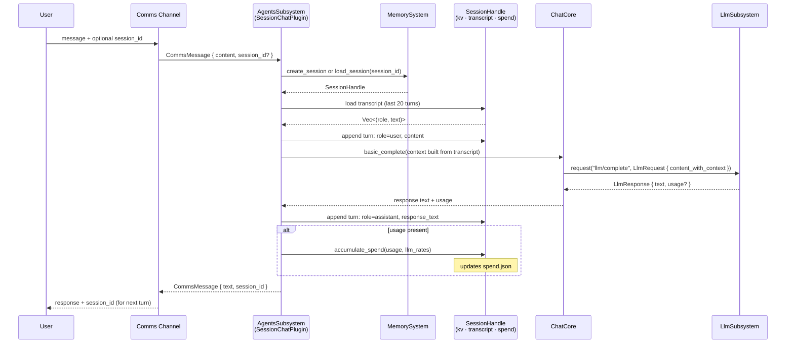

---

## 5. Comms Subsystem and Channels

The Comms subsystem provides all external I/O. Each channel is an independent
Tokio task using a shared `CommsState` capability boundary.

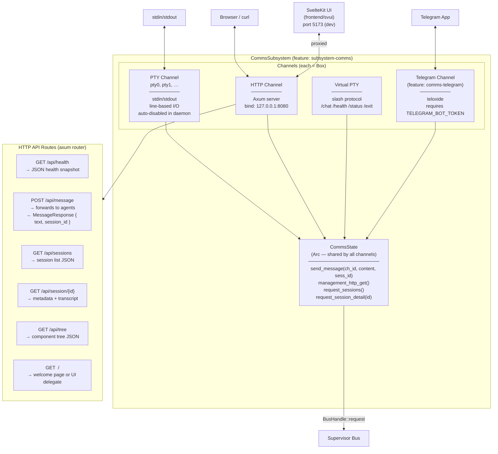

---

## 6. Memory System

The Memory subsystem manages sessions, key-value working memory,
transcript history, token spend, and optional document indexing.

```mermaid
graph TB
    subgraph MEM["MemorySystem  (feature: subsystem-memory)"]
        direction TB

        MS["MemorySystem\n─────────────────────────\ncreate_session(store_types, agent)\nload_session(session_id)\nlist_sessions()"]

        subgraph SESS["Session (per conversation)"]
            SH["SessionHandle\n─────────────────────────\nkv_get / kv_set\nappend_turn(role, content)\nget_transcript(last_n)\naccumulate_spend(usage, rates)\nget_spend()"]
            KV["kv.json\n(capped k-v store\nmax kv_cap entries)"]
            TR["transcript.md\n(role: content lines\nmax transcript_cap turns)"]
            SP["spend.json\n(input_tokens, output_tokens\ncost_usd running totals)"]
        end

        subgraph STORES["Session Store Backends"]
            TMP["TmpStore\n(in-memory, no disk)"]
            BASIC["BasicSessionStore\n(~/.araliya/bot-pkey{id}/memory/\nsessions.json index)"]
        end

        subgraph DOCS["Document Stores  (feature-gated)"]
            DS["DocStore\n(feature: idocstore)\n─────────────\nSQLite + FTS5\nBM25 search\nadd_doc, search_chunks"]
            KGD["KG DocStore\n(feature: ikgdocstore)\n─────────────\nentity graph\nBFS from seeds\nedge weighting\nhybrid FTS + KG"]
        end

        MS --> SH
        SH --> KV
        SH --> TR
        SH --> SP
        MS --> TMP
        MS --> BASIC
        MS --> DS
        MS --> KGD
    end

    subgraph DISK["Disk Layout  (~/.araliya/bot-pkey{id}/)"]
        D1["sessions.json\n(index: id · created_at · types · spend)"]
        D2["sessions/{uuid}/kv.json"]
        D3["sessions/{uuid}/transcript.md"]
        D4["sessions/{uuid}/spend.json"]
        D5["agent/{name}-{id}/docstore/chunks.db"]
        D6["agent/{name}-{id}/kgdocstore/\nentities.json · relations.json · graph.json"]
    end

    BASIC --> D1
    BASIC --> D2
    BASIC --> D3
    BASIC --> D4
    DS --> D5
    KGD --> D6
```

---

## 7. Identity Hierarchy

Each bot instance and each named agent has a persistent ed25519 keypair.
`public_id` is derived as `hex(SHA256(verifying_key))[..8]`.

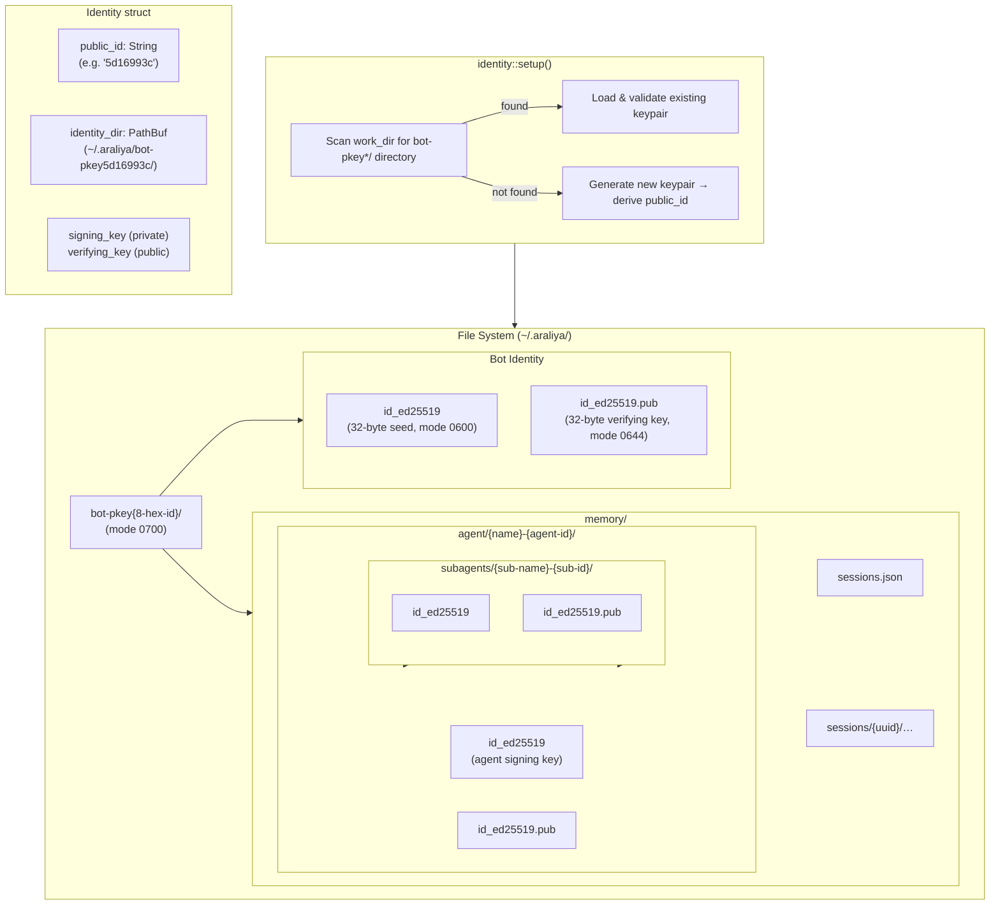

---

## 8. Component Runtime and Fail-fast

`spawn_components` runs a set of `Component` tasks under a shared
`CancellationToken`. Any component failure cancels all siblings.

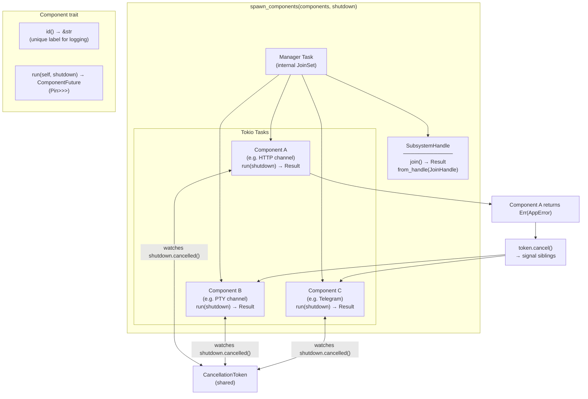

---

## Key Types Quick Reference

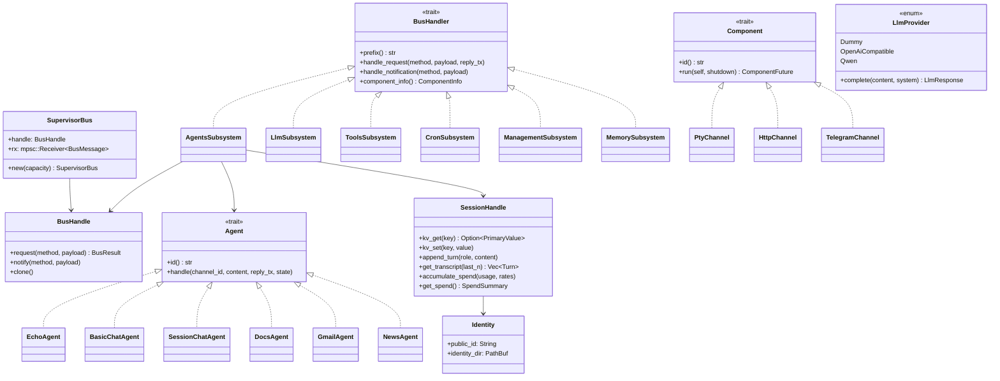
