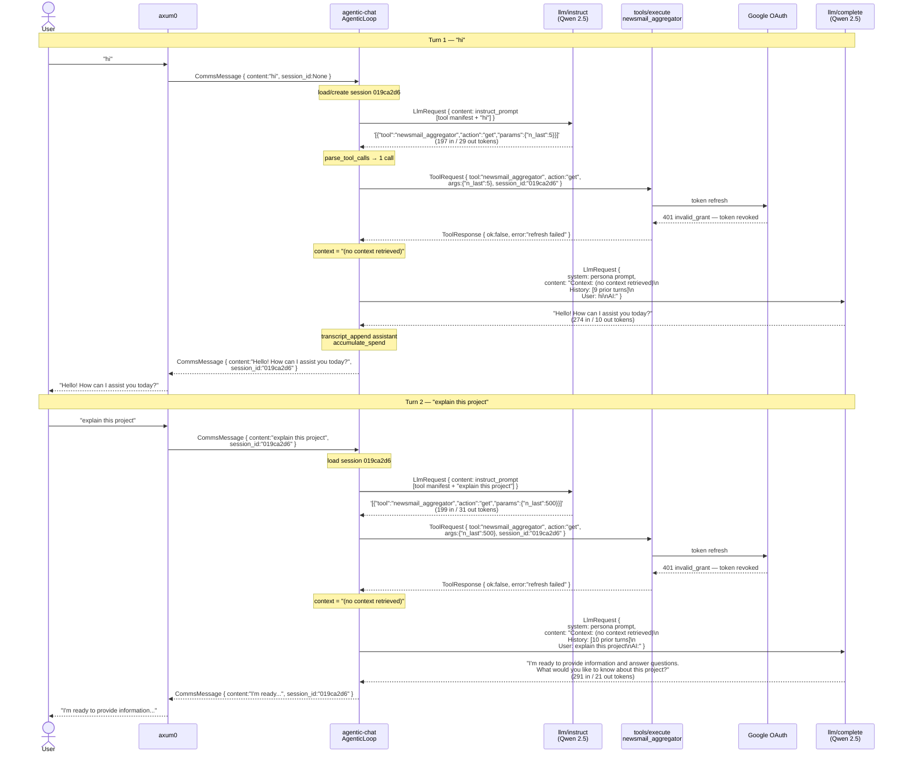

# Agent / LLM Message Flow (from trace output)

Two turns captured: user sends `"hi"` then `"explain this project"`.

## Observations from this trace

- **Instruction LLM is too eager** — for both `"hi"` and `"explain this project"` it calls
  `newsmail_aggregator`, which is inappropriate. The instruct prompt needs tighter guidance
  or the tool manifest needs better descriptions.
- **OAuth token is revoked** — `newsmail_aggregator` fails both turns; agent degrades
  gracefully to `(no context retrieved)` and still responds.
- **History grows each turn** — response pass carries the full prior transcript (9 → 10
  turns), consuming more tokens each request (274 → 291 input tokens).
- **Session persists** — `session_id: 019ca2d6` is reused across both turns correctly.
